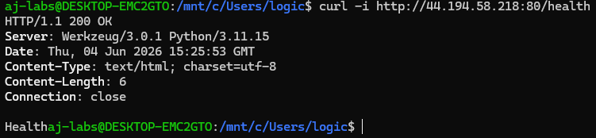
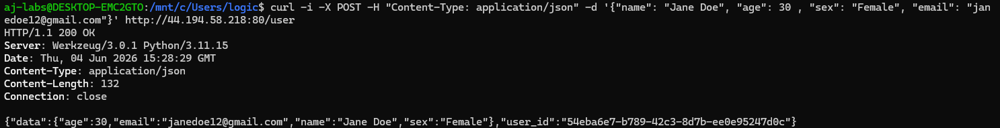
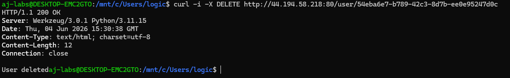
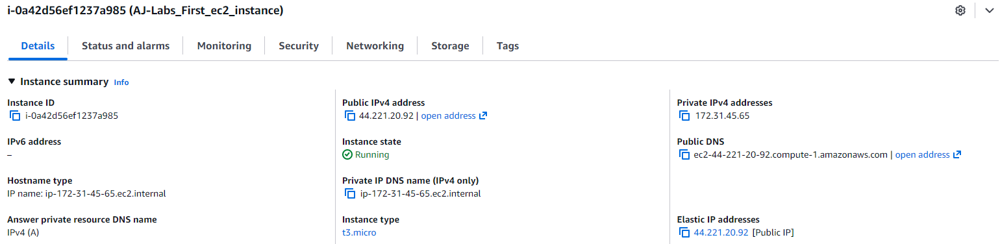
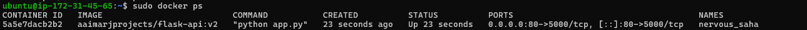

# What Is It

A Flask REST API built using python code. It has three endpoints a /health endpoint which returns a health message to show that the container is alive, a POST /user endpoint that creates a new user, and a DELETE /user/user_id endpoint that deletes a user. I ran this on my AWS EC2 instance with an Elastic IP, and Docker installed to pull and create a container using my public image on docker hub. 

## What tools were used and why

### EC2

An EC2 instance is a Virtual Machine that is deployed using AWS hardware. I deployed an Ubuntu EC2 instance because I wanted to create a VM in the cloud and experiment with the additional AWS features offered.

### Security Groups

A Security Group was added to only allow ssh traffic in from my host ip and also to allow http traffic in, so that traffic to my Flask Rest API is not blocked. This is the first line of defense because it stops traffic before it even reaches the EC2 instance. This is because security groups exist on the AWS architecture layer.

### Elastic IP

An Elastic IP is a static IP that AWS reserves for you so that your IP Address does not change. This was used because every time I stop and start back my EC2 instance it gets a different public IP, and I need my IP to not change when I deploy my Flask API, so that when a user sends a request using that IP the request does not break.

### Docker

Docker is a tool used to containerize application so that it doesn't break during deployment. By using Docker file I reduced my image size by 86.5% because I used python slim in the final build stage which got rid of build tools, pip and extra tools which take up a lot of space, make the attack surface bigger, and because these tools are no longer needed to run the application. By doing so the image takes up 86.5% less space on my disk and can be pulled quicker from docker hub since it is a smaller image. The image that I built was uploaded to Docker hub `aaimarjprojects/flask-api:v2`. So by downloading docker on my EC2 instance I am able to pull and create a container using my image with `docker run -d -p 80:5000 aaimarjprojects/flask-api:v2`.

## How to Run It

1) Create an AWS account. 

2) Enable 2FA on the root account.

3) Create a regular user account with administrator privileges and switch to it.

4) Add MFA on the regular user account.

5) Create a key pair in WSL.  

6) Create an EC2 instance using an Ubuntu VM, import the ssh public key created in WSL, and only allow ssh traffic in from your host IP.

7) Download docker on the EC2 instance using the docker install instructions on docker website.

8) Pull the image from docker hub and create a container using this command which does both `docker run -d -p 80:5000 aaimarjprojects/flask-api:v2`.

9) Add a Security Group rule to allow inbound traffic from anywhere to port 80. 

10) Add an elastic IP to the EC2 instance. 

11) Now the Flask REST API can be access by anyone.

## How to Send Requests to the Flask Rest API Endpoints

| Endpoint | Request | Successful Response |
| --- | --- | --- |
| /health | `curl http://<EC2_instance_public_ip>:80/health`| Returns 200 OK and a health message if the container is alive |
| POST /user | `curl -i -X POST -H "Content-Type: application/json" -d '{"name": "<"enter_name_here">", "age": <enter_age_here>, "sex": <"enter_sex_here">, "email": <"enter_email_here">}' http://<EC2_instance_public_ip>:80/user`| Returns 200 OK and a message with the user details and user_id |
| DELETE /user/user_id | `curl -i -X DELETE http://<EC2_instance_public_ip>:80/user/<enter_user_id_here>`| Returns 200 Ok and User Deleted message |

### What Each Flag Does

-i shows the HTTP Response Header, -X specifies the HTTP Method, -H tell it to expect JSON text, and -d is used for data that is being sent in the request. 

### Evidence

## Proof it Works

The live API is no longer active because AWS charges for a public IP addresses that are being used, and elastic IP addresses whether they are in use or not because public IP addresses are not free. So using the evidence below you will see screenshots of the EC2 instance when it was up and running. 

